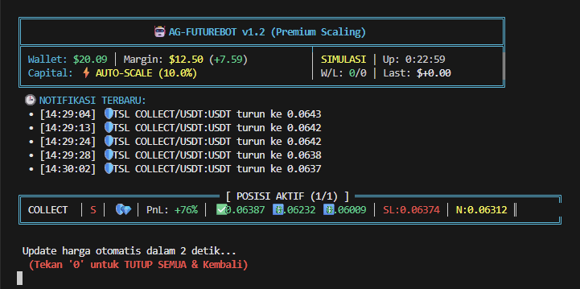
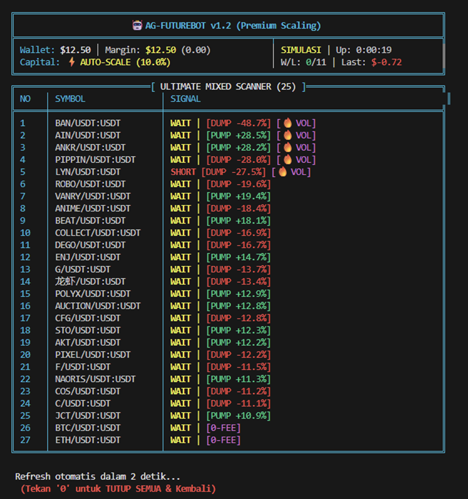
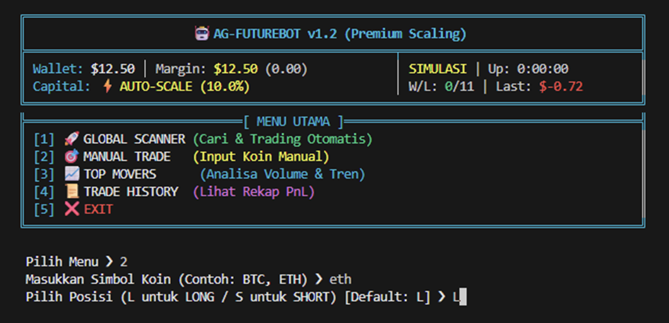
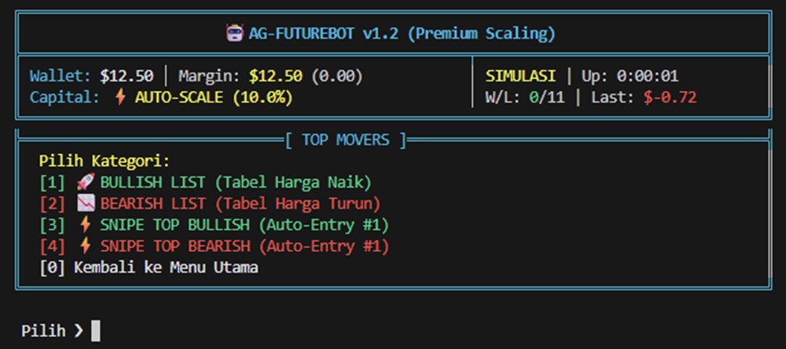
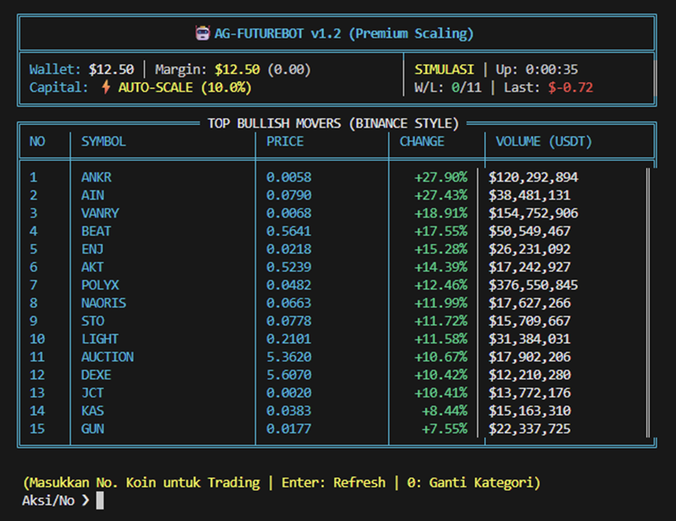
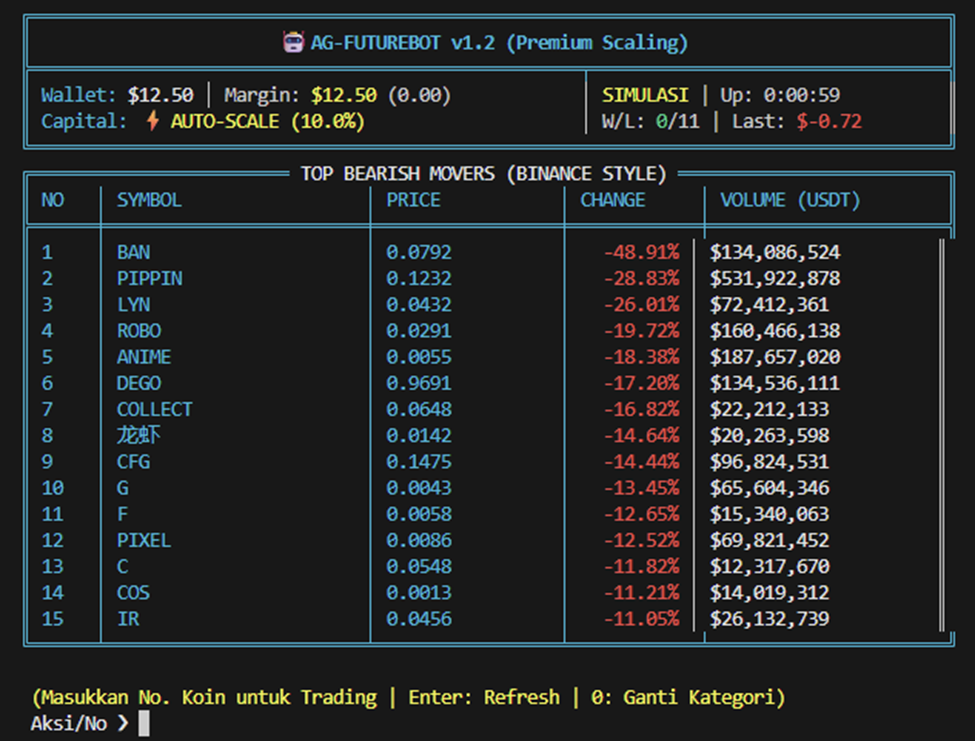
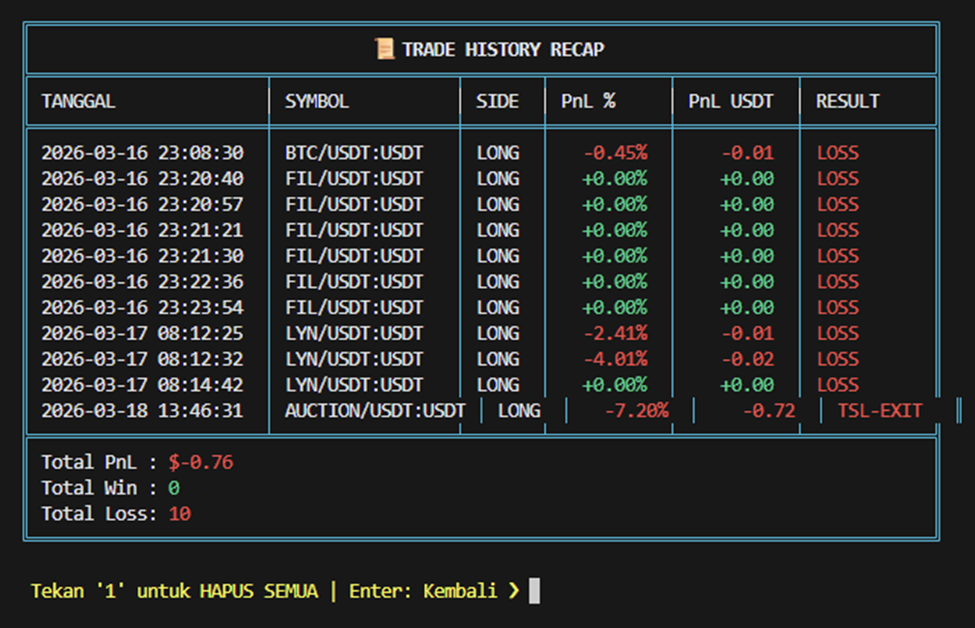
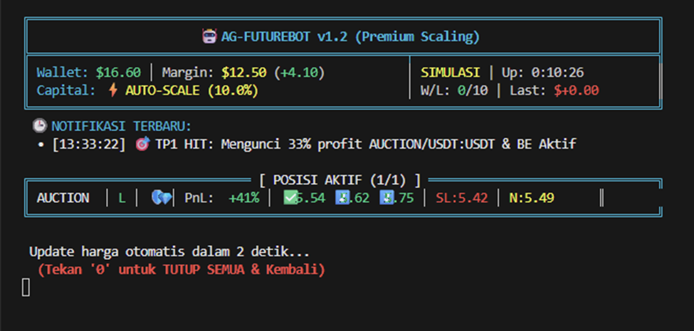

# 🤖 AG-FUTUREBOT v1.2 (Premium Scaling)
### *Advanced Binance Futures Auto-Trading Engine with Real-Time Analytics*


*(Tampilan Beranda Utama AG-FUTUREBOT dengan informasi Dompet & Modal Skala Otomatis)*

---

## 🌟 Deskripsi Proyek
**AG-FUTUREBOT** adalah sistem perdagangan otomatis canggih yang dirancang khusus untuk pasar *Binance Futures (USDT-M)*. Fokus utama bot ini adalah stabilitas, efisiensi, dan keamanan modal. Dengan menggabungkan analisis teknikal *multi-timeframe*, manajemen risiko dinamis, dan sistem *scaling* modal otomatis, bot ini bertujuan memaksimalkan peluang *profit* sambil membatasi eksposur risiko secara ketat.

Dibangun dengan ketangguhan **Python** dan **CCXT**, bot ini menghadirkan *dashboard* interaktif langsung di terminal Anda. Sistem ini juga memiliki dukungan pemformatan cerdas untuk koin-koin berpresisi tinggi ("koin micin") secara dinamis tanpa merusak antarmuka pengguna (UI).

---

## 🚀 Fitur Unggulan

### 1. 🎯 Strategi Trading Sniper (V2 - Institutional Grade)
* **EMA 9 & 21 Crossover:** Menggunakan kombinasi standar profesional untuk membaca momentum yang lebih akurat dan stabil dibandingkan setting 7/14.
* **EMA 50 (The Pulse):** Berfungsi sebagai filter tren menengah pada *timeframe* eksekusi. Entry LONG hanya terbuka jika harga berada di atas EMA 50, dan SHORT jika di bawahnya.
* **RSI Guard (Relative Strength Index):** Mengamankan entry dengan mencegah posisi LONG di area *overbought* (>70) atau posisi SHORT di area *oversold* (<30).
* **Macro Trend Filter:** Filter tren makro menggunakan EMA 200 di *timeframe* 1H untuk memastikan bot berjalan searah dengan tren besar pasar global.
* **Momentum & Volume Guard:** Hanya mengeksekusi perdagangan jika terdapat volatilitas (`ADX > 20`) dan lonjakan volume minimal 60% dari rata-rata sebelumnya.

### 2. 🛡️ Manajemen Risiko Berlapis (Premium Scaling)
* **Triple-Layer Take Profit (TP):**
    * **TP1:** Menutup 33% posisi dan menggeser *Stop Loss* ke titik *Break-Even* (Titik Impas/Aman).
    * **TP2:** Menutup 33% posisi berikutnya untuk mengamankan profit lanjutan.
    * **TP3:** Target maksimal yang dikalkulasi berdasarkan indikator ATR (*Average True Range*).
* **Dynamic Trailing Stop Loss (TSL) 💎:** Fitur premium yang otomatis "membuntuti" pergerakan harga saat profit menyentuh 20%, memastikan cuan tidak menguap saat pasar tiba-tiba berbalik arah.
* **Auto-Scale Margin (Compound Interest):** Ukuran posisi disesuaikan otomatis berdasarkan persentase saldo bebas terkini, memungkinkan modal berkembang secara proporsional.

---

## 🖥️ Antarmuka & Navigasi (Ultimate Dashboard)
Bot ini menyediakan navigasi terminal yang rapi dan terstruktur. Berikut adalah fitur menu beserta tampilannya:

### [1] Global Scanner & Auto-Trade
Bot memindai hingga 25 koin secara *real-time* (*Top Gainers, Losers, atau Mixed*) dan melakukan *sniping* otomatis jika sinyal terpenuhi.


### [2] Manual Trade
Ingin trading koin pilihan Anda sendiri? Masukkan simbol koin (misal: ETH, BTC) dan tentukan posisinya (LONG/SHORT), bot akan mengeksekusi dan mengawalnya untuk Anda.


### [3] Top Movers (Analisa Volume & Tren)
Lihat pergerakan koin dengan perubahan harga tertinggi saat ini. Tersedia daftar Bullish dan Bearish untuk dianalisa.

*Sub-menu Top Movers: Tampilan Bullish Movers (kiri) dan Bearish Movers (kanan).*
<p align="center">
  
  
</p>

### [4] Trade History
Pantau rekam jejak, detail PnL (% dan USDT), dan riwayat eksekusi (Win/Loss/TSL-Exit) Anda dengan rapi.


### 📊 Live Position Monitor
Saat posisi aktif masuk, layar akan berubah menjadi monitor pemantauan langsung yang menampilkan status PnL, target TP (✅), fitur Trailing (💎), dan garis pengaman (🛡️).


---

## 🔒 Keamanan & Perlindungan
Keamanan adalah prioritas utama. AG-FUTUREBOT dilengkapi dengan:
* **DRY RUN (Simulasi):** Mode simulasi penuh untuk *backtesting* dan menguji strategi tanpa mempertaruhkan uang sungguhan.
* **Isolated Margin:** Default beroperasi dalam mode *Isolated* agar risiko likuidasi tidak menyebar ke saldo utama Anda.
* **Leverage Guard:** Sistem pintar yang otomatis menyesuaikan tuas (leverage) jika permintaan awal ditolak oleh Binance.
* **Emergency Stop:** Tombol panik (tekan '0') untuk segera menutup semua posisi terbuka dan membatalkan antrean order secara instan.

---

## 🛠️ Persyaratan Sistem & Instalasi

### 📋 Prasyarat
*   Python 3.8 atau lebih tinggi
*   Binance API Key (dengan izin: Read & Futures)
*   Virtual Environment (Disarankan)

### ⚙️ Instalasi
1.  Kloning atau unduh folder project ini.
2.  Buka terminal di direktori project.
3.  Install dependensi yang diperlukan:
    ```bash
    pip install ccxt pandas ta-lib
    ```
4.  Buka file `future_bot.py` dan masukkan API Key Anda:
    ```python
    API_KEY = "MASUKKAN_API_KEY_ANDA"
    SECRET   = "MASUKKAN_SECRET_KEY_ANDA"
    ```

---

## 🎮 Cara Menjalankan

Jalankan bot dengan perintah:
```bash
python future_bot.py
```

### Navigasi Menu:
*   **[1] Global Scanner:** Bot akan mencari koin terbaik secara mandiri dan langsung melakukan trading otomatis.
*   **[2] Manual Trade:** Masukkan nama koin pilihan Anda sendiri (contoh: BTC, ETH) untuk dianalisa dan dieksekusi.
*   **[3] Top Movers:** Lihat pergerakan koin dengan volume dan perubahan harga tertinggi saat ini.
*   **[4] Trade History:** Lihat rekam jejak PnL Anda secara detail.
*   **[5] Exit:** Keluar dari program dengan aman.

---

## 📜 Logika Visual (Indikator Dashboard)
*   🛡️ **Perisai:** Fitur Break-Even aktif (Stop Loss sudah di harga masuk).
*   💎 **Berlian:** Trailing Stop Loss aktif (Profit sedang dikawal).
*   ✅ **Centang:** Target TP1 atau TP2 sudah berhasil dicapai.
*   🚀 **Roket:** Target TP3 tercapai secara maksimal.

---

## ⚠️ Disclaimer
**Trading Cryptocurrency membawa risiko tinggi.** Bot ini adalah alat bantu keputusan dan pengelolaan posisi. Hasil masa lalu tidak menjamin kinerja masa depan. Gunakan modal yang siap Anda lepaskan (*Risk Capital*). Penulis tidak bertanggung jawab atas kerugian finansial yang timbul dari penggunaan software ini.

---
*Dibuat dengan ❤️ oleh AG-FutureBot Development Team.*
